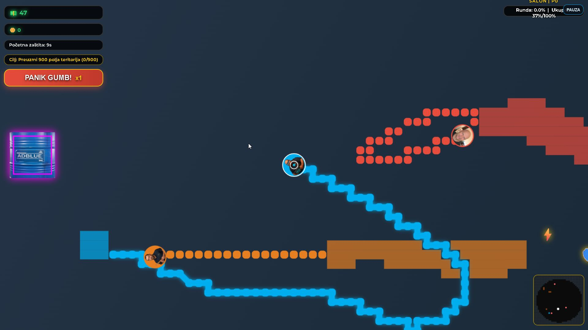
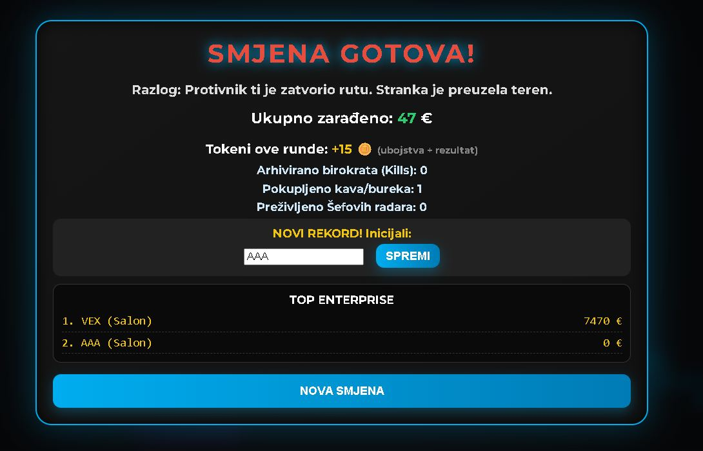

# EFAC-Paper.io-clone

A game inspired by **Paper.io**-style mechanics, featuring the EFAC service team.

## Preview

<table>
  <tr>
    <td align="center">
      
       <b>Main game menu, first screen after load</b>
    </td>
    <td align="center">
      
       <b>Character selection screen</b>
    </td>
  </tr>
  <tr>
    <td align="center">
      
       <b>Gameplay, action in game</b>
    </td>
    <td align="center">
      
       <b>Game Over screen, you're dead — try again</b>
    </td>
  </tr>
</table>

## Play it now
**Live demo:** https://igrazazderu.netlify.app

---

## 🏎️ EFAC: Enterprise — The Ultimate Service Center Osvajanje

Welcome to **EFAC: Enterprise** — a fast-paced, high-stakes tactical **“conquer-the-map”** game based on the legendary mechanics of **Paper.io 2**, set in the chaotic world of a premium Mercedes‑Benz service center.

## 🎭 The Context (The Lore)

Forget generic cubes. In this game, you play as one of the “Fantastic Four” service advisors from the front desk. Your mission is simple: survive your shift, conquer the showroom floor, and avoid getting **“archived”** by angry customers or the dreaded **Boss Radar**.

### The Legends
- **Zrina (The Dev-Hack):** Coding his way through the bureaucracy.
- **Maminjo (The Deep Diver):** Cold-blooded, emotionless, and practically invisible.
- **Ždero (The Skeptic):** Known for his “Immeasurable Impact” and infinite patience.
- **Franc (The VIP Magnet):** Top-tier speed, fueled by Dinamo Zagreb energy.

## 🔊 Language & Music Disclaimer (The Soul of the Game)

If you hear epic blues/rock ballads or see menus that look like they belong in a Slavic technical manual — don’t panic.

- **Soundtrack:** All songs were custom-composed using **Suno AI**. The lyrics are in **Croatian**, written to capture the existential dread and dark humor of working in high-end car service.
- **Interface:** The game menu and “Trash Talk” bubbles are in **Croatian**. It’s not a bug — it’s an authentic “Enterprise” experience. If a character shouts at you, they are probably complaining about a Bjelovar registration plate or a missing C.W. term.

## 🚀 Key Features

- **Boss Radar:** Every minute, the “Big Boss” enters the field with a red radar cone. Get caught in his sight, and your productivity (speed) drops to zero.
- **Alibi Button (Panic Mode):** A unique “get out of jail free” card that clears enemy trails in your vicinity.
- **Faux‑3D Graphics:** Custom textures (Couches, Barrels, Plants) from the original EFAC 3D project.
- **Prestige & Nightmare Modes:** Conquer “Showroom,” “Workshop,” and “Management,” then loop into harder difficulties, culminating in **Nightmare Mode** (Radar OFF, Glitch effects ON).

## 🛠️ Tech Stack

- **HTML5 / JavaScript / Canvas API** (no heavy engines — just raw logic)
- **PWA-ready** (installable on mobile)
- **Suno AI** (Croatian blues/rock service-desk soundtrack)

---

## 🎮 Notes

This project is a tribute to the “Four Idiots” of the EFAC service desk.  
If you’re a random visitor — welcome to our shift.
